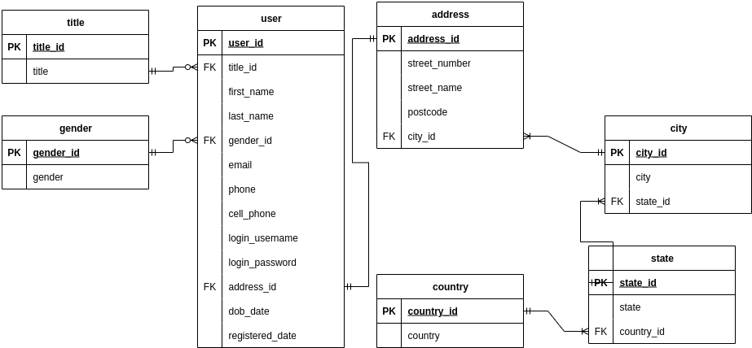
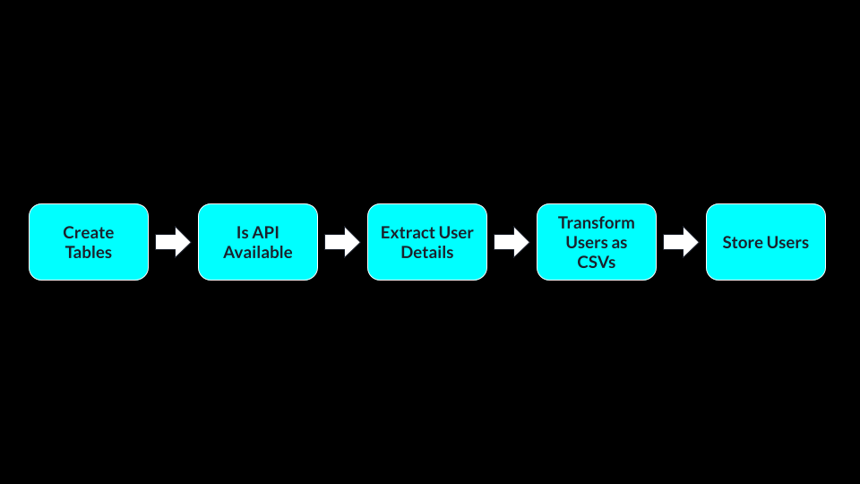

# 🌀 Airflow ETL Pipeline

## 📄 Overview

This project demonstrates a simple **ETL (Extract, Transform, Load)** pipeline orchestrated with **Apache Airflow**. The pipeline:

- **Extracts** user data from the [Random User API](https://randomuser.me/)
- **Transforms** the data into a normalized relational format
- **Loads** the structured data into a PostgreSQL database

---

## 📚 Table of Contents

1. [📄 Overview](#-overview)
2. [🧬 ERD Diagram](#-erd-diagram)
3. [🔄 Pipeline Diagram](#-pipeline-diagram)
4. [🛠️ Setup Instructions](#-setup-instructions)
5. [🚀 Running the Project](#-running-the-project)
6. [🛑 Stopping Services](#-stopping-services)
7. [🗂️ Project Structure](#-project-structure)
8. [📬 Contact](#-contact)
9. [🧑‍💻 Contributing](#-contributing)

---

## 🧬 ERD Diagram

The **Entity Relationship Diagram (ERD)** illustrates how user data is structured and stored in a normalised format, in the PostgreSQL database:



---

## 🔄 Pipeline Diagram

The **Airflow ETL Pipeline Diagram** visualizes the flow of data for the DAG:



---

## 🛠️ Setup Instructions

### ✅ Prerequisites

Make sure the following are installed:

- [Docker](https://www.docker.com/)
- [Python 3.12.x](https://www.python.org/)
- [uv (Python package manager)](https://docs.astral.sh/uv/)

### ⚙️ Installation Steps

1. **Clone the repository:**
   ```bash
   git clone https://github.com/DanielSolomon7/Airflow-ETL-Pipeline
   cd Airflow-ETL-Pipeline
   ```

2. **Create and activate a virtual environment:**
   ```bash
   uv venv --python 3.12.6
   source .venv/bin/activate
   ```

3. **Install required packages:**
   ```bash
   uv pip install -r requirements.txt
   ```

4. **Start services using Docker Compose:**
   ```bash
   docker compose up
   ```

---

## 🚀 Running the Project

Once the containers are running:

1. Access the **Airflow UI** at [http://localhost:8080](http://localhost:8080)
2. Go to: `Admin` → `Connections`
3. Configure the PostgreSQL connection:
   - **Connection ID**: `postgres`
   - **Connection Type**: `postgres`
   - **Host**: `postgres`
   - **Login**: `airflow`
   - **Password**: `airflow`
   - **Port**: `5432`

Then trigger the DAG to start the pipeline.

---

## 🛑 Stopping Services

To gracefully stop the Docker containers, use:

```bash
Ctrl + C
```

---

## 🗂️ Project Structure

```plaintext
Airflow-ETL-Pipeline/
│
├── dags/
│   └── etl_pipeline.py         # Defines the DAG and tasks for the ETL workflow
│
├── docker-compose.yml         # Docker services including Airflow, Postgres, and supporting containers
├── requirements.txt           # Python dependencies for the pipeline
├── .env                       # (Optional) Environment variables for local development
├── README.md                  # Project overview and setup guide
└── .venv/                     # Local Python virtual environment (ignored in version control)
```

---

## 📬 Contact

For questions, issues, or suggestions, feel free to open an issue or reach out via GitHub.

---

## 🧑‍💻 Contributing

To contribute:

1. **Fork this repo**
2. **Create a new branch:**
   ```bash
   git checkout -b feature/my-new-feature
   ```
3. **Make your changes**
4. **Commit with clear messages:**
   ```bash
   git commit -m "Add feature: my-new-feature"
   ```
5. **Push to your fork:**
   ```bash
   git push origin feature/my-new-feature
   ```
6. **Open a pull request** to the `main` branch

### 🧼 Development Tips

- Format Python code with tools like `black`
- Use meaningful commit messages
